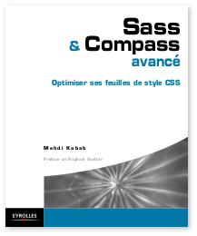

Codes sources du livre *Sass & Compass avancé*
==============================================

Sources du livre **[Sass et Compass avancé, optimiser ses feuilles de style CSS][livre1]**, paru aux [Éditions Eyrolles][eyrolles].

[][livre2]

Procédure d'installation
------------------------

### Pré-requis

Votre système doit disposer de Ruby, RubyGems et de Bundler.  
Si tel n'est pas le cas, reportez-vous au chapitre 1 pour installer Ruby et RubyGems, puis au chapitre 7 pour installer Bundler.

### Récupérer les sources

Deux possibilités s'offrent à vous pour récupérer les codes sources du livre : *via* le fichier ZIP mis à disposition ou en clonant le projet.

Si vous optez pour la seconde option, commencez par vous déplacer dans votre répertoire utilisateur (par exemple), puis clonez le projet :

```shell
$ cd ~
$ git clone https://github.com/piouPiouM/livre-sass-compass-avance.git
```

Les codes sources du livre sont désormais disponibles dans le répertoire `~/livre-sass-compass-avance/`.

### Installation automatisée

Utilisateurs de Mac OS X, Linux, ou tout autre *nix qui se respecte, le projet est fourni avec un fichier qui automatise l'installation des différentes versions de Sass et de Compass nécessaires à chaque chapitre, voire exercice.

À l'aide de la ligne de commande, déplacez-vous à la racine du projet précédemment récupéré, puis exécutez le fichier `INSTALL.sh`, comme suit :

```shell
$ cd ~/livre-sass-compass-avance/
$ ./INSTALL.sh
```

### Installation manuelle

Si vous souhaitez travailler pour la première fois avec Sass et/ou Compass dans l'un des chapitre, veuillez prendre connaissance des indications qui suivent pour correctement initialiser votre environnement de travail :

1. À l'aide de la ligne de commande, déplacez-vous dans le répertoire du chapitre désiré.
2. Lancez l'installation des librairies Ruby requises par le chapitre. N'oubliez pas de préciser un répertoire `../.vendors` qui accueillera les différentes *gem*, ce qui évitera d'interférer avec l'environnement global de votre système. Comme vous pouvez le remarquer, le répertoire est situé à la racine des codes sources, ce qui permet de partager les *gems* entre les différents chapitre. L'installation est ainsi accélérée.
3. Désormais, le simple fait de vous déplacer dans ce répertoire et ses enfants indiquera au système les librairies à utiliser.

Par exemple, si vous souhaitez travailler sur le chapitre 2 :

```shell
$ cd ~/livre-sass-compass-avance/ch02/
$ bundle install --path ../.vendors
```

Typiquement, vous aurez à exécuter cette dernière commande lorsque vous croiserez un fichier j'ai nommé `Gemfile` à la racine d'un chapitre ou d'un exercice.

Licence
-------

Sauf mention contraire, le présent matériel est publié sous [licence MIT](./LICENSE).

[livre1]:    http://livre-sass-compass.fr/ "Plus d'informations sur le livre Sass et Compass avancé"
[livre2]:    http://livre-sass-compass.fr/
[eyrolles]: http://www.eyrolles.com/
